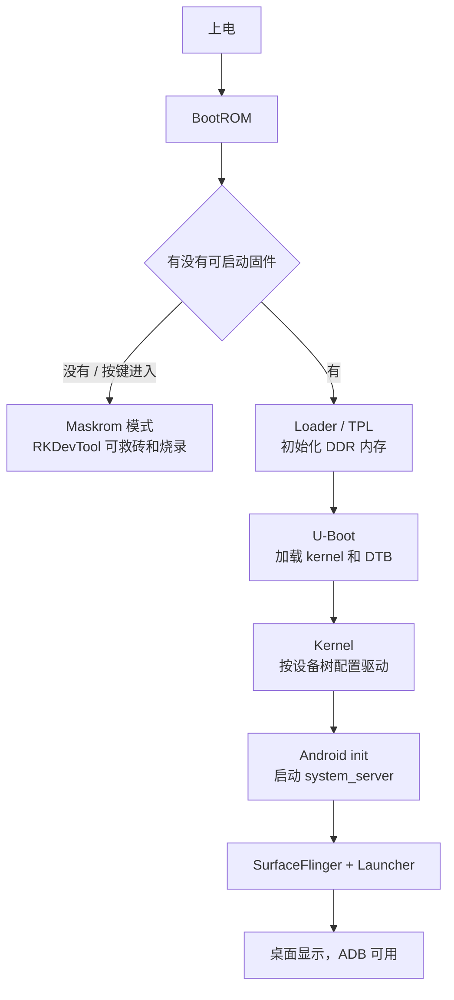

# RK3399 启动流程（第 4 天任务）

目标：不看资料能画出 RK3399 从“上电”到“进入 Android 桌面”的完整链路，并知道 Loader / Maskrom 两种刷机模式。

## 启动链路图

## 每个阶段的职责

| 阶段 | 干什么 | 出问题怎么判断 |
| --- | --- | --- |
| BootROM | 芯片上电后最先运行，找可启动固件 | 卡死无输出，可能进 Maskrom |
| Loader / TPL | 初始化 DDR，加载 U-Boot | 串口停在内存初始化 |
| U-Boot | 初始化硬件，加载 kernel 和 DTB | 串口能看到 U-Boot 菜单 |
| Kernel | 按 DTB 加载屏幕、音频、WiFi 等驱动 | `dmesg` 里有驱动报错 |
| Android init | 启动系统服务和桌面 | logcat 或黑屏 |
| 桌面 | 用户看到系统界面 | 能操作，ADB 可用 |

## 两种刷机模式

- Loader 模式：系统 U-Boot 已起来，等待 RKDevTool 连接，正常刷机用。
- Maskrom 模式：BootROM 层，固件完全坏了也能进，用来救砖和强制烧录。

## 验收

- [ ] 不看资料，能画出 上电 → BootROM → Loader → U-Boot → Kernel → Android → 桌面 的框图
- [ ] 能说出 Loader 和 Maskrom 的区别
- [ ] 知道刷机、救砖分别用哪种模式
